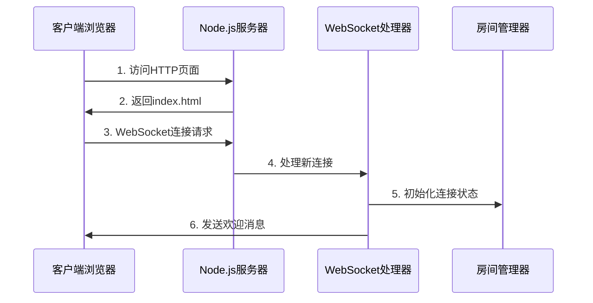
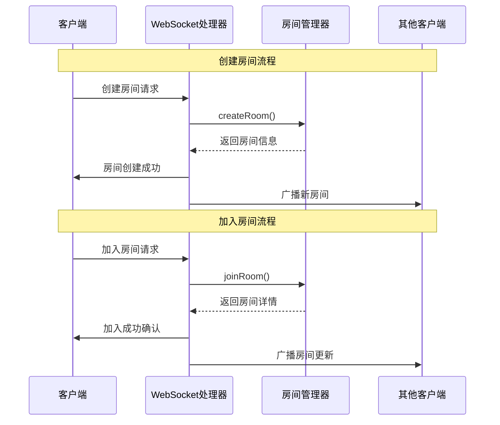
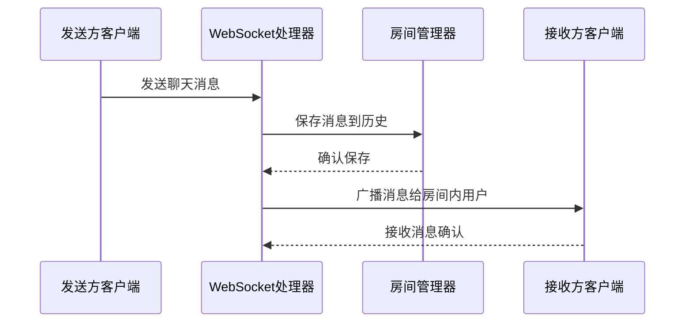

# WebSocket房间聊天系统 - 项目原理学习指引

## 项目概述

本项目是一个基于WebSocket的实时房间聊天系统，提供了多房间聊天、实时消息传递、房间管理等功能。项目采用前后端分离架构，服务器端使用Node.js + Express + ws，客户端使用原生HTML/CSS/JavaScript实现。

---

## 1. 项目整体架构设计与模块划分

### 1.1 系统架构图

```
┌─────────────────┐    WebSocket    ┌─────────────────┐
│                 │ ─────────────── │                 │
│   客户端浏览器   │                 │   Node.js服务器 │
│   (index.html)  │ ◄────────────── │   (index.js)    │
│                 │                 │                 │
└─────────────────┘                 └─────────────────┘
         │                                   │
         │ HTTP                              │
         ▼                                   ▼
    ┌─────────┐                    ┌─────────────────┐
    │  静态   │                    │   WebSocket     │
    │  资源   │                    │   处理器        │
    │         │                    │ (websocketHandler.js)
    └─────────┘                    └─────────────────┘
                                          │
                                          ▼
                                   ┌─────────────────┐
                                   │   房间管理器    │
                                   │ (roomManager.js)│
                                   └─────────────────┘
```

### 1.2 核心模块划分

#### 服务器端模块
1. **index.js** - 主入口模块
   - HTTP服务器初始化
   - 静态资源服务
   - WebSocket服务器启动

2. **websocketHandler.js** - WebSocket连接处理器
   - WebSocket连接管理
   - 消息路由和分发
   - 房间操作处理

3. **roomManager.js** - 房间管理核心
   - 房间生命周期管理
   - 用户-房间关系映射
   - 消息历史管理

#### 客户端模块
1. **index.html** - 单页面应用
   - 用户界面布局
   - WebSocket客户端逻辑
   - 状态管理

---

## 2. 关键技术栈应用原理

### 2.1 WebSocket协议应用

#### 2.1.1 服务器端WebSocket实现

```javascript
// index.js 中的WebSocket服务器创建
const WebSocket = require('ws');
const wss = new WebSocket.Server({ server });

// 绑定连接处理事件
wss.on('connection', (ws, req) => {
    console.log('新的WebSocket连接');
    websocketHandler.handleConnection(ws, req);
});
```

**核心特性：**
- 全双工通信：客户端和服务器可同时发送消息
- 持久连接：避免HTTP轮询的开销
- 实时性：消息即时传递

#### 2.1.2 客户端WebSocket实现

```javascript
// 前端连接建立
ws = new WebSocket('ws://localhost:3000');
ws.onopen = function(event) { /* 连接成功 */ };
ws.onmessage = function(event) { /* 接收消息 */ };
ws.onclose = function(event) { /* 连接关闭 */ };
ws.onerror = function(error) { /* 连接错误 */ };
```

**协议流程：**
1. 客户端发起握手请求（HTTP升级）
2. 服务器响应101状态码
3. 建立WebSocket连接
4. 双向实时通信

### 2.2 Express.js框架应用

```javascript
// HTTP服务器配置
const express = require('express');
const app = express();

// 静态资源服务
app.use(express.static('public'));

// HTTP路由
app.get('/', (req, res) => {
    res.sendFile(__dirname + '/index.html');
});

// 启动服务器
const server = app.listen(3000, () => {
    console.log('HTTP服务器启动在端口3000');
});
```

### 2.3 数据结构设计

#### 2.3.1 房间数据结构
```javascript
const room = {
    id: roomId,           // 房间唯一标识
    name: roomName,       // 房间名称
    users: new Set(),     // 用户ID集合
    createdAt: string,    // 创建时间
    maxUsers: number,     // 最大用户数
    isPrivate: boolean,   // 是否私有
    description: string,  // 房间描述
    messages: []          // 消息历史
};
```

#### 2.3.2 用户管理映射
```javascript
// RoomManager 中的核心映射关系
this.rooms = new Map();      // roomId -> roomInfo
this.userRooms = new Map();  // userId -> roomId
```

#### 2.3.3 消息协议结构
```javascript
// 客户端发送消息格式
{
    type: 'room_message',
    roomId: 'room123',
    message: 'Hello World',
    from: 'user456',
    timestamp: '2023-01-01T00:00:00.000Z'
}

// 服务器广播消息格式
{
    type: 'room_message',
    roomId: 'room123',
    roomName: '聊天室',
    message: 'Hello World',
    from: 'user456',
    timestamp: '2023-01-01T00:00:00.000Z'
}
```

---

## 3. 核心功能实现逻辑

### 3.1 房间管理逻辑

#### 3.1.1 创建房间流程

```javascript
// 服务器端处理
handleCreateRoom(ws, data) {
    const { roomId, roomName, description, options } = data;
    
    try {
        // 创建房间
        const room = roomManager.createRoom(roomId, roomName, {
            description,
            ...options
        });
        
        // 广播新房间
        this.broadcast({
            type: 'room_created',
            room: room
        });
        
        // 发送确认给创建者
        ws.send(JSON.stringify({
            type: 'room_created',
            room: room
        }));
        
    } catch (error) {
        // 发送错误信息
        ws.send(JSON.stringify({
            type: 'error',
            message: error.message
        }));
    }
}
```

#### 3.1.2 加入房间流程

```javascript
// 客户端发送加入请求
function joinRoom(roomId) {
    const data = {
        type: 'join_room',
        roomId: roomId,
        username: username
    };
    ws.send(JSON.stringify(data));
}

// 服务器端处理
handleJoinRoom(ws, data) {
    const { roomId, username } = data;
    const userId = this.generateUserId();
    
    try {
        // 加入房间
        const room = roomManager.joinRoom(userId, roomId, { username });
        
        // 保存用户连接映射
        this.userSockets.set(userId, ws);
        
        // 发送房间信息给用户
        ws.send(JSON.stringify({
            type: 'room_joined',
            room: room
        }));
        
        // 通知其他用户有新用户加入
        this.broadcastToRoom(roomId, {
            type: 'room_update',
            room: roomManager.getRoom(roomId)
        });
        
    } catch (error) {
        // 处理加入失败
    }
}
```

### 3.2 消息传递机制

#### 3.2.1 消息发送流程

```javascript
// 客户端发送消息
function sendMessage() {
    const data = {
        type: 'room_message',
        roomId: currentRoom.id,
        message: message,
        from: username,
        timestamp: new Date().toISOString()
    };
    ws.send(JSON.stringify(data));
}

// 服务器端消息处理和广播
handleRoomMessage(ws, data) {
    const { roomId, message, from, timestamp } = data;
    
    // 获取房间名称
    const room = roomManager.getRoom(roomId);
    if (!room) return;
    
    // 构建广播消息
    const broadcastMessage = {
        type: 'room_message',
        roomId: roomId,
        roomName: room.name,
        message: message,
        from: from,
        timestamp: timestamp
    };
    
    // 广播给房间内所有用户
    this.broadcastToRoom(roomId, broadcastMessage);
    
    // 保存消息到历史记录
    roomManager.addMessage(roomId, {
        type: 'user_message',
        content: message,
        username: from,
        timestamp: timestamp
    });
}
```

---

## 4. 数据流转过程分析

### 4.1 用户连接流程



### 4.2 房间操作流程



### 4.3 消息传递流程



---

## 5. 主要算法和业务规则

### 5.1 用户ID生成算法

```javascript
// websocketHandler.js 中的用户ID生成
generateUserId() {
    return `user_${Date.now()}_${Math.random().toString(36).substr(2, 9)}`;
}
```

**算法特点：**
- 时间戳保证唯一性基础
- 随机字符串避免冲突
- 前缀标识用户类型

### 5.2 房间负载均衡算法

```javascript
// joinRoom 方法中的用户分配逻辑
joinRoom(userId, roomId, userInfo = {}) {
    const room = this.rooms.get(roomId);
    
    // 检查房间容量
    if (room.users.size >= room.maxUsers) {
        throw new Error(`房间 ${room.name} 已满员`);
    }
    
    // 先退出其他房间（如果存在）
    if (this.userRooms.has(userId)) {
        this.leaveRoom(userId);
    }
    
    room.users.add(userId);
    this.userRooms.set(userId, roomId);
}
```

### 5.3 消息ID生成算法

```javascript
// roomManager.js 中的消息ID生成
generateMessageId() {
    return `msg_${Date.now()}_${Math.random().toString(36).substr(2, 9)}`;
}
```

**设计优势：**
- 时间戳保证时间顺序
- 随机字符串避免冲突
- 前缀区分不同ID类型

### 5.4 数据一致性规则

#### 5.4.1 用户-房间映射一致性
```javascript
// 确保 userRooms 和 rooms 数据同步
leaveRoom(userId) {
    const roomId = this.userRooms.get(userId);
    if (!roomId) return false;
    
    const room = this.rooms.get(roomId);
    if (room) {
        room.users.delete(userId);  // 从房间用户列表移除
        
        // 房间为空时删除房间
        if (room.users.size === 0) {
            this.deleteRoom(roomId);
        }
    }
    
    this.userRooms.delete(userId);  // 从用户房间映射移除
    return true;
}
```

#### 5.4.2 消息历史管理规则
```javascript
// 消息历史限制，防止内存溢出
addMessage(roomId, message) {
    const room = this.rooms.get(roomId);
    if (!room) {
        throw new Error(`房间 ${roomId} 不存在`);
    }
    
    const messageWithTimestamp = {
        ...message,
        timestamp: new Date().toISOString(),
        id: this.generateMessageId()
    };
    
    // 添加到房间消息历史
    room.messages.push(messageWithTimestamp);
    
    // 限制消息历史数量（保留最近100条）
    if (room.messages.length > 100) {
        room.messages = room.messages.slice(-100);
    }
    
    return messageWithTimestamp;
}
```

---

## 6. 各组件间交互机制

### 6.1 事件驱动架构

#### 6.1.1 WebSocket事件处理
```javascript
// 服务器端事件绑定
wss.on('connection', (ws, req) => {
    console.log('WebSocket连接建立');
    
    ws.on('message', (message) => {
        try {
            const data = JSON.parse(message);
            websocketHandler.handleMessage(ws, data);
        } catch (error) {
            console.error('消息解析错误:', error);
        }
    });
    
    ws.on('close', () => {
        console.log('WebSocket连接关闭');
        websocketHandler.handleDisconnect(ws);
    });
    
    ws.on('error', (error) => {
        console.error('WebSocket错误:', error);
        websocketHandler.handleError(ws, error);
    });
});
```

#### 6.1.2 消息类型路由
```javascript
// websocketHandler.js 中的消息路由
handleMessage(ws, data) {
    console.log(`处理消息类型: ${data.type}`);
    
    switch(data.type) {
        case 'ping':
            this.handlePing(ws, data);
            break;
        case 'join_room':
            this.handleJoinRoom(ws, data);
            break;
        case 'leave_room':
            this.handleLeaveRoom(ws, data);
            break;
        case 'room_message':
            this.handleRoomMessage(ws, data);
            break;
        case 'create_room':
            this.handleCreateRoom(ws, data);
            break;
        case 'get_rooms':
            this.handleGetRooms(ws, data);
            break;
        default:
            console.log(`未知消息类型: ${data.type}`);
    }
}
```

### 6.2 客户端状态管理

#### 6.2.1 全局状态变量
```javascript
// 前端状态管理
let ws = null;                    // WebSocket连接对象
let isConnected = false;          // 连接状态
let connectionStartTime = null;   // 连接开始时间
let currentRoom = null;           // 当前所在房间
let username = '测试用户';         // 当前用户名
let rooms = new Map();            // 房间列表缓存
let roomMembers = new Map();      // 房间成员缓存
```

#### 6.2.2 状态同步机制
```javascript
// 前端消息处理和状态更新
function handleMessage(data) {
    switch(data.type) {
        case 'room_joined':
            currentRoom = data.room;     // 更新当前房间
            updateCurrentRoomInfo();     // 更新UI
            updateRoomMembers(data.room.users || []);  // 更新成员列表
            break;
            
        case 'room_left':
            currentRoom = null;          // 清除当前房间
            updateCurrentRoomInfo();     // 更新UI
            updateRoomMembers();         // 清空成员列表
            break;
            
        case 'room_update':
            // 更新房间缓存
            rooms.set(data.room.id, data.room);
            renderRoomList();            // 重新渲染房间列表
            break;
    }
}
```

### 6.3 错误处理和恢复机制

#### 6.3.1 连接异常处理
```javascript
// 客户端连接恢复
ws.onclose = function(event) {
    isConnected = false;
    updateConnectionStatus('disconnected');
    
    // 自动重连逻辑
    if (event.code !== 1000) {  // 非正常关闭
        setTimeout(() => {
            if (!isConnected) {
                connect();  // 尝试重连
            }
        }, 5000);
    }
};
```

#### 6.3.2 消息可靠性保证
```javascript
// 客户端消息发送确认
function sendMessage() {
    if (!ws || ws.readyState !== WebSocket.OPEN) {
        addMessage('错误: 未连接到服务器', 'error');
        return;
    }
    
    try {
        ws.send(JSON.stringify(data));
        // 添加本地确认机制
        setTimeout(() => {
            checkMessageDelivery(data);
        }, 3000);
    } catch (error) {
        addMessage('发送消息错误: ' + error.message, 'error');
    }
}
```

---

## 7. 性能优化和扩展性设计

### 7.1 内存管理优化

1. **消息历史限制**：每个房间最多保存100条消息
2. **连接清理**：断线用户自动清理房间映射关系
3. **空房间回收**：房间无用户时自动删除

### 7.2 扩展性设计

1. **模块化架构**：功能分离，便于功能扩展
2. **事件驱动**：松耦合的组件交互
3. **配置化设计**：房间参数可配置（最大用户数、私有属性等）

### 7.3 安全性考虑

1. **输入验证**：服务器端验证所有用户输入
2. **连接限制**：支持最大连接数控制
3. **消息频率控制**：防止消息轰炸（可扩展）

---

## 8. 部署和运维

### 8.1 依赖管理
```json
{
  "dependencies": {
    "ws": "^8.0.0",      // WebSocket库
    "express": "^4.18.0" // HTTP服务器框架
  },
  "devDependencies": {
    "nodemon": "^2.0.0"  // 开发时自动重启
  }
}
```

### 8.2 启动配置
```json
{
  "scripts": {
    "start": "node index.js",
    "dev": "nodemon index.js"
  }
}
```

---

## 总结

本项目展现了一个完整的WebSocket实时通信系统的设计思路和实现细节。通过模块化架构、事件驱动设计、数据结构优化等技术，构建了一个稳定、可扩展的聊天系统。项目的核心价值在于：

1. **实时性**：基于WebSocket的全双工通信
2. **可扩展性**：模块化设计便于功能扩展
3. **稳定性**：完善的错误处理和恢复机制
4. **易维护性**：清晰的代码结构和文档

通过学习本项目，可以深入理解WebSocket技术、实时系统设计、前后端交互模式等核心技术概念。